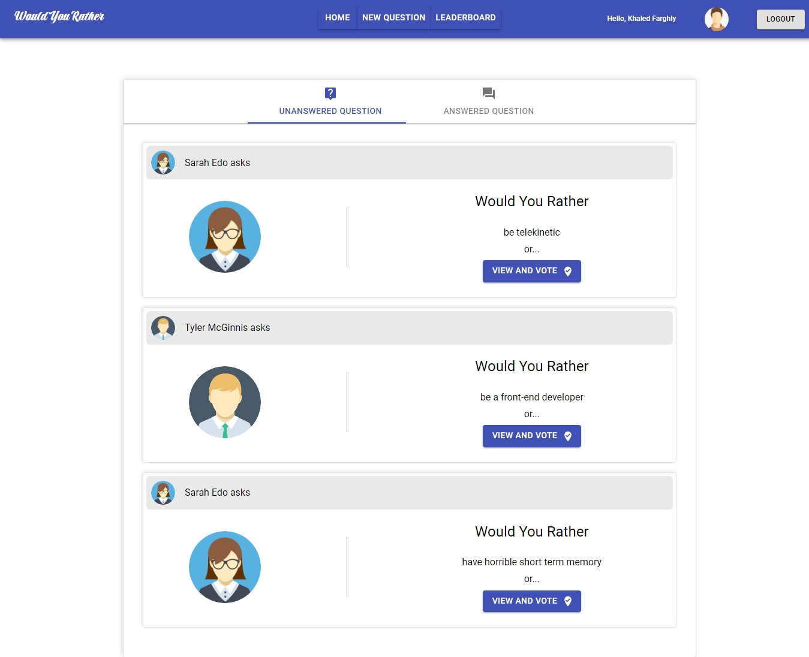

# Would You Rather React redux App

This is my solution for the final assessment project for Udacity's React & Redux course ( the 2d project in the advanced Web Dev Nanodegree).

- Live demo : [Would you rather](https://wouldyourrather.netlify.app)
- Starter repo: [Starter code](https://github.com/udacity/reactnd-project-would-you-rather-starter)

- [Overview](#overview)
- [Built with](#built-with)
- [The project requirements](#the-project-requirements)
- [What I learned](#what-I-learned)
- [Acknowledgments](#acknowledgments)
- [Author](#author)

# Overview

The `_DATA.js` file represents a fake [Database.md](./data.md) and methods that let you access the users and questions data.

There are two types of objects stored in the database:

- Users
- Questions

The application requires only "npm install" and "npm start" to install and launch the project.

## Built with

- Material Ui
- CSS flexbox
- React js
- React router 6
- Redux

## The project requirements

Users should be able:

- To log in by select an exsisting user at home page, and see the Navigation bar with 3 buttons to navigate between "home" "Add Question" and "Leaderboard".

- To see the unanswered Questions by default, and there are tabs to navigate between the answered and unanswered questions at the home page, related to which user is selected.

- To see the avatar for the signed-in user besides a button to log out at the navigation bar.

- To see every question in the unanswered and answered questions sections has the question author name and his avatar and first choice, and button to vote or see votes if you're in answered section.

- To Click "view and vote" button to see the question choices with question author, avatar, and button to vote on the question.
  after voting, the user will navigate to the answered questions page, and see his vote, and other votes on the question from other users.

- To add new question in the database by click on add question at the navigation bar

- To see the users ordered by descending order based on the sum of the number of questions they’ve answered and the number of questions they’ve asked.

## What I learned

1- this project had solidify my understanding of React and Redux,
by practicing to improve the predictability of the application’s state, establish strict rules for getting, listening, and updating the store(state); and identify what state should live inside of Redux and what state should live inside of React components, and I felt how the Redux make the state management much better than react alone.

2- I started using react hooks and get much better in manipulate data between components.

3- I've implemented the most complex logic I've ever coded during the last six months when I started learning front end Dev; while destructuring data from the database using advanced Javascript methods like "filter", "map", "sort", " looping around object values and keys" and more!

4- I started learning the Material Ui library and use it for this project to give me some elements that helped me style components very well, and I'm looking forward to getting better at using it and improving the project to better design in the future.

## Acknowledgments

- [W3school](https://www.w3schools.com/)
- [MDN](https://developer.mozilla.org/en-US/)
- [Udacity](https://www.udacity.com/)
- [Egyfwd scholarship](https://egfwd.com/)

## Author

Development by : Khaled Farghly

- [Github ](https://github.com/KhaledMostafa990)
- [LinkedIn ](https://www.linkedin.com/in/khaled-farghly-056a57208/)
